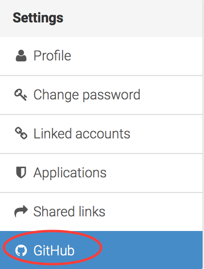
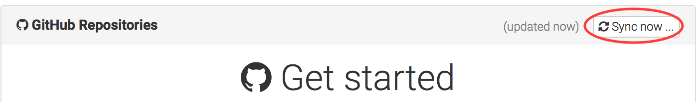
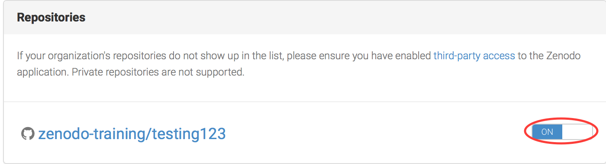
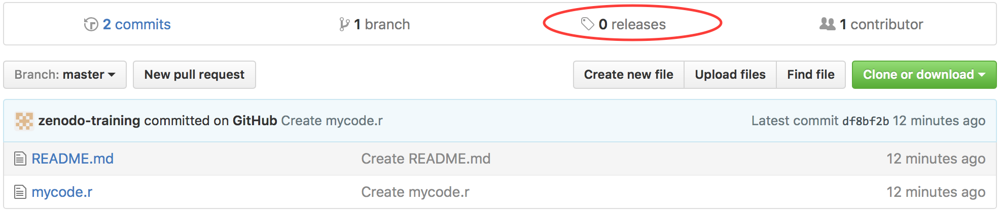
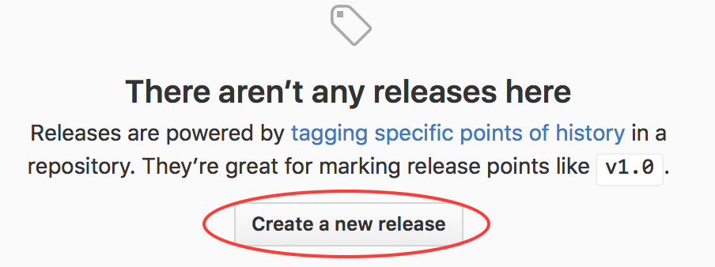
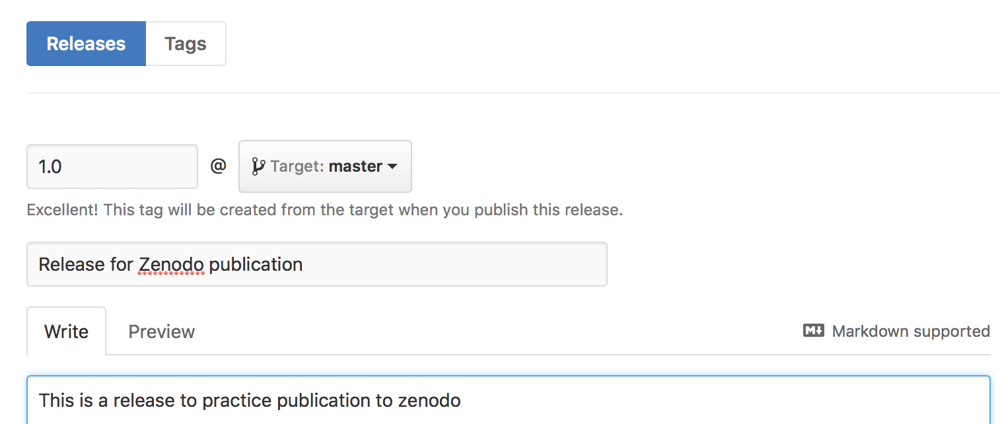
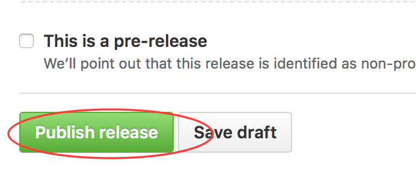
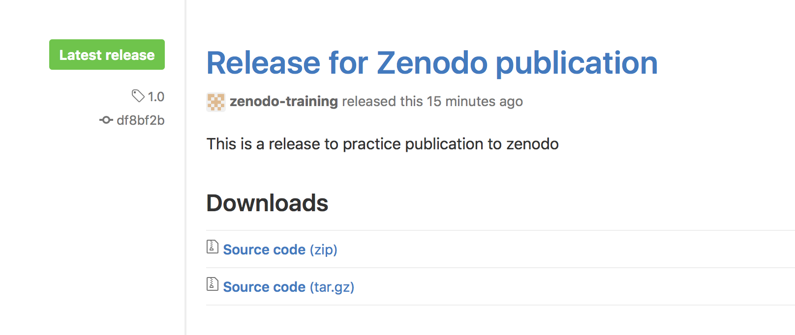
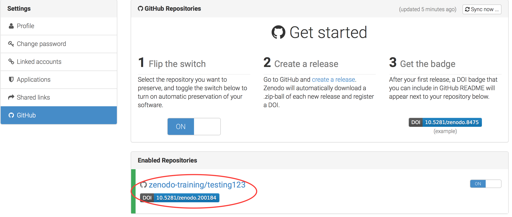

# Publishing from a GitHub repository to Zenodo

It is good practice to develop your software on Github (as demonstrated elsewhere in this workshop).
Additionally, once your code is in GitHub, it is straightforward to publish it on Zenodo.
We will learn how to do this in this section.

## Creating something to publish

If you have not yet worked through the other sessions of this workshop, you may not have anything on GitHub to publish. If this is the case, please work through the section below

* [Creating a GitHub repo directly from GitHub](quick_github_repo.md)

If you already have a project on GitHub, you may skip this step.

## Selecting which repositories we wish to preserve in Zenodo

Log in to Zenodo using your GitHub account. In the **Settings** pane click on **GitHub**.

On the right hand side of the screen click **sync now**. Your GitHub repositories should appear

In the **Repositories** pane, ensure that the slider for the repository we want to publish is set to **On**

## Making a release in GitHub.

In GitHub, we make releases when we have reached some sort of landmark in our code development. Reasons may include 'The first time the graph looks about right' or 'This one is actually usable!'.

We are free to make as many releases as we like for any repo. They are usually denoted by version number such as 1.0, 1.1 etc.

Since releases mark special points in our software's development, it is these that Zenodo preserves rather than our everyday commits.

Go back to GitHub and the repo we wish to publish in Zenodo. Click on the text that says **0 Releases**

On the next screen, click on **Create a new release**

On the next screen, you will be asked to fill out information about this release such as the version number (**1.0**), A release title (**Release for Zenodo publication**) and some descriptive text about this release (**This is a release to practice publication to Zenodo**).

Scroll to the bottom of the screen and click **Publish Release**.

Our software is now formally released to the world. We are free to continue development but this version of our code will remain static.

It is also the version that has been published in Zenodo! Here is the one created by me as I created this training material: https://zenodo.org/record/200184

Every time we make a new release from this GitHub repo, Zenodo will create a unique DOI for it and archive it.

As such, every version of our software will be individually citable.

Go back to Zenodo to see your own publication.

Click [here](README.md) to go back to the front page.
