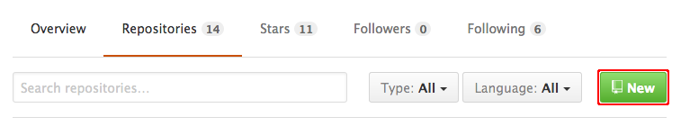
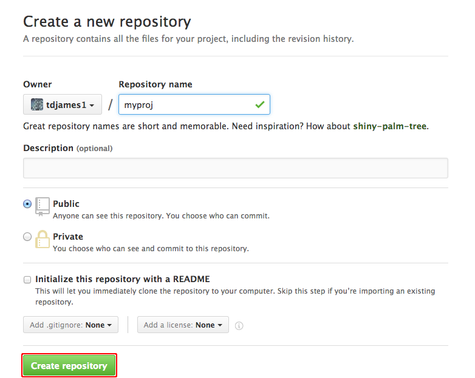
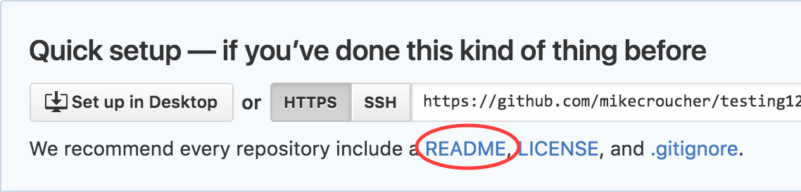
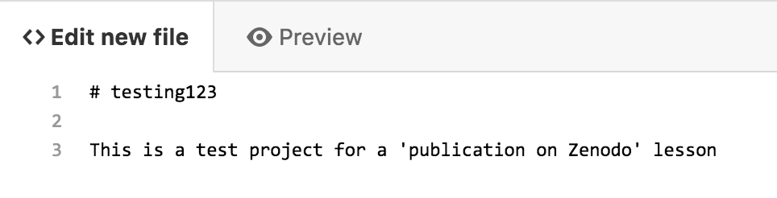
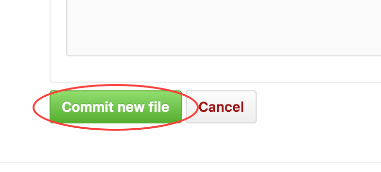
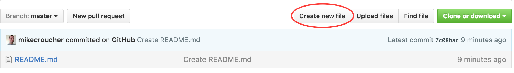
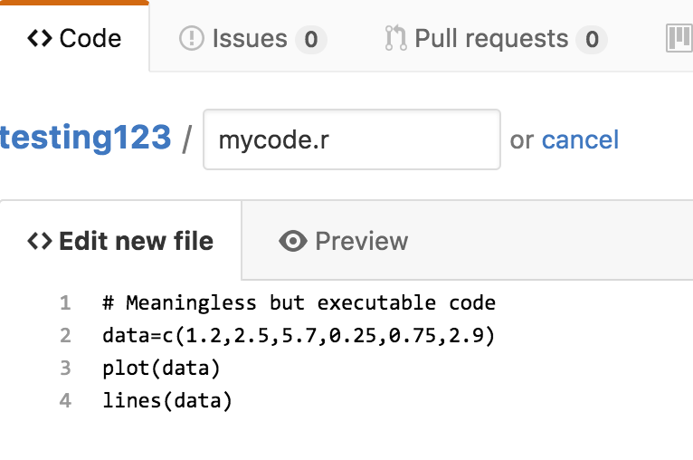
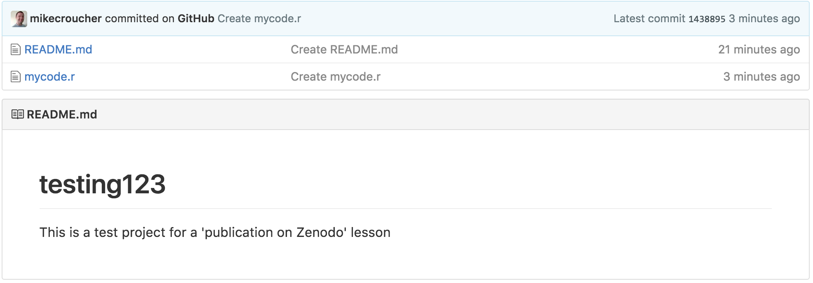

# Creating a GitHub repo directly from GitHub

If you have not yet worked through the other sessions of this workshop, you may not have anything on GitHub to publish.
If this is the case, we'll quickly create something now.

You should have created a GitHub account already. Log into GitHub and go to your profile page. On the **Repositories** tab, click **New**.

At the **Create a new repository** screen, give your repository a name and click **Create Repository**.

In the **Quick Setup** section, click on the README link to create a new README file directly from GitHub.

A text editor will open in the browser in which you can add text to your Readme file.

Once you've finished editing, scroll to the bottom of the screen and click **Commit new file**.

You now have a skeletal project. Let's add some code.
On the repository main page, click on **Create new file**

Create a file called **mycode.r** and put some executable R code in it.

Scroll down to the bottom of the screen and click **Commit new file**.

Your repo will now look something like the one below. It is unlikely to win any scientific awards but it will serve our purposes here.

Click [here](README.md) to go back to the front page.
