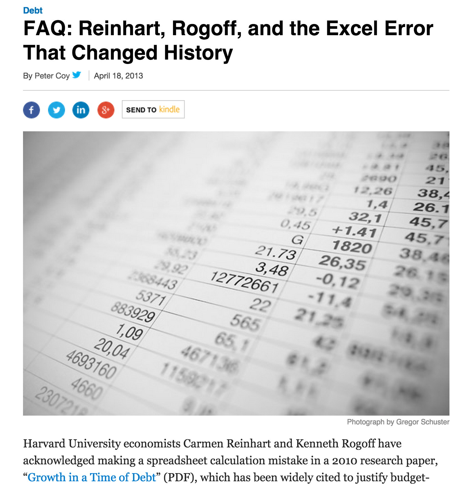

# What software should we publish?

There is a tendency among many researchers to believe that it's not worth publishing certain software artifacts because they seem relatively trivial. Phrases such as **"It's just a few lines of R"** or **"It's only an Excel spreadsheet with a couple of formulae"** are commonly given as excuses not to publish.

A trivial mistake in a simple Excel spreadsheet helped change the world (see https://www.bloomberg.com/news/articles/2013-04-18/faq-reinhart-rogoff-and-the-excel-error-that-changed-history).
Publishing that simple spreadsheet along with the paper would have helped prevent many problems.

The software citation guidelines stop short of recommending exactly what should be published. They leave such choices to the researcher.

We recommend that you should publish any software that produces results on which your conclusions are founded. If your software is "only" an Excel spreadsheet that contains 20 data points along with a calculation of the mean -- publish it anyway. At least it can be checked that you really did include all of the data points (unlike Reinhart and Rogoff!).

Click [here](README.md) to go back to the front page.
