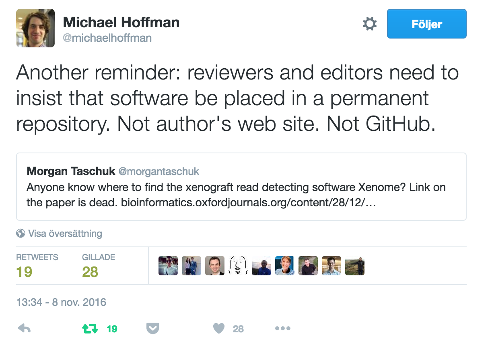

# Where should you publish your code?

In order to make our code citable according to the [software citation principles](./software_citation.md) we first need to publish it somewhere. Traditional locations include an author's website, a departmental webpage, a listing at the back of a paper or, more recently, GitHub.

None of these are suitable publication locations since they do not satisfy all of the citation principles. The principal one being **Persistence**.

It is extremely common for research software to go missing.

GitHub is a fine place to develop software but we need something more permanent for software that is to become part of the scholarly record.

# Zenodo

In this session, we introduce and recommend the use of [Zenodo](https://zenodo.org/faq). Zenodo is a free (for most usage) service, developed by CERN, that is available to researchers from all fields.

Software and data deposited with Zenodo is provided with a globally unique [Digital Object Identifier](https://www.doi.org/) and its storage is guaranteed for a long period of time. If used in association with GitHub, Zenodo automatically records information such as authorship and software version.

Combined, these features help ensure that all the software citation principles can be met for many use cases.

An example of a Zenodo deposit can be found by clicking on  which contains materials from a 'Version control in R and RStudio' workshop given in mid-2016.

Click [here](README.md) to go back to the front page.
