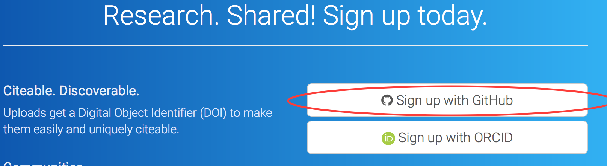
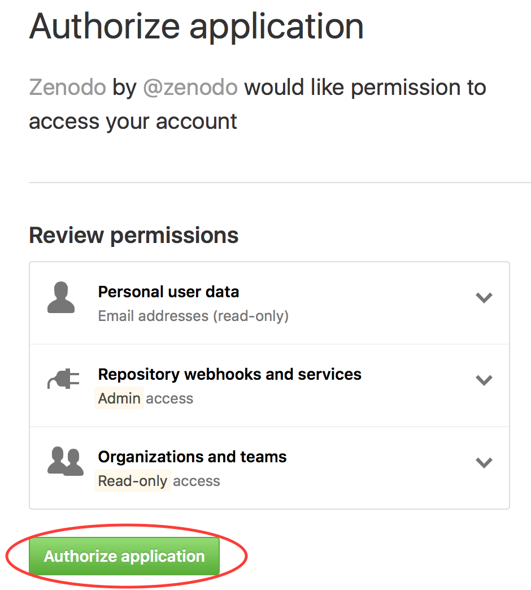
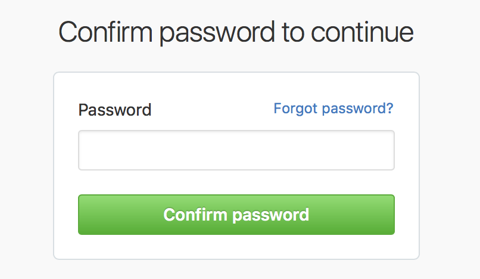

# Connecting Zenodo to a GitHub account

Before you begin this section, you must first create a GitHub account.

Go to [https://zenodo.org/](https://zenodo.org/) and click on **Sign up**

Click **Sign up with GitHub**

Click on **Authorize application**

You will be asked to confirm your password

This completes the association of Zenodo and your GitHub account
